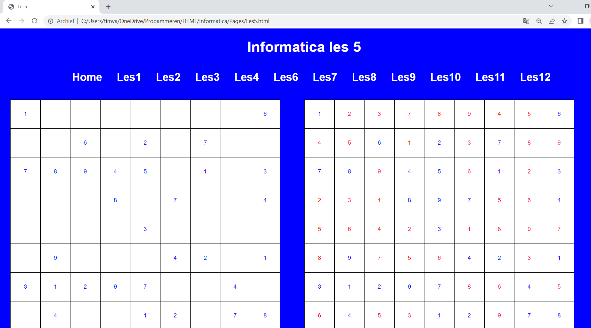
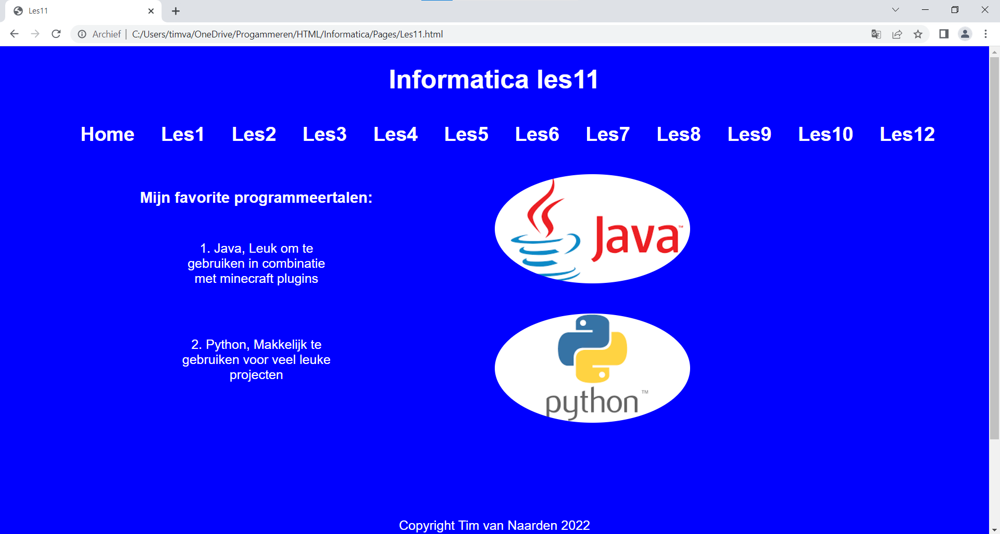
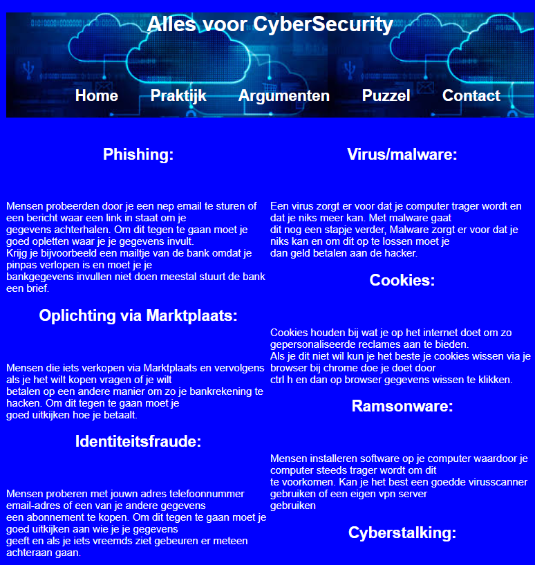

<h1> HTML & CSS</h1>  

<!--Voeg hier minstens 3 plaatjes toe van je eindproduct, bonuspunten voor video's -->

    
 
        
Hier rechts is de voorpagina van de webiste te zien die ik in de tweede heb gemaakt, helaas is deze website op webtinq gemaakt en weet ik niet meer de url.

        
Hieronder is een sudoku te zien in combinatie met de oplossing er naast:

        
        
Ook heb ik afbeeldingen gebruikt als links:

        
    

    

        
    

<!--Beantwoord de volgende vragen -->
<h3> Welke verworven kennis uit de lessen heb je gebruikt in je uitopdracht? </h3>
<h4> Ik heb zelf in de tweede klas al een website gemaakt, waarbij elk concept al voorkwam, ik heb dan ook een hele simpele website gemaakt. In mijn website heb ik veel dingen hergebruikt uit mijn oude website. Ik heb dus geen verworven kennis uit de lessen gebruikt omdat ik deze kennis al had uit de tweede. Ik heb wel dingen zoals links, tables, footers en headers gebruikt ook heb ik mijn eigen stylesheet gemaakt en gelinkt.</h4>

<h3> Ben je nog tegen moeilijkheden aangelopen? </h3>
<h4> Tijdens het maken van de website heb ik ook veel tijd gestoken in het Informatica netwerk, die ook nog eens gehackt was. Dit heeft er voor gezorgd dat ik minder tijd had voor mijn website, en veel heb geleerd over netwerken. </h4>

<h3> Wat ging goed en wat ging minder goed? </h3>
<h4> Het maken van de website ging goed, alleen last gehad van de eerder genoemde hack. </h4>

<h3> Ben je tevreden over je eindproduct? </h3>
<h4> Ik ben zeker tevreden over mijn eindproduct, zeker gezien de tijd die ik er in heb gestoken en de dingen die ik heb geleerd over netwerken. </h4>